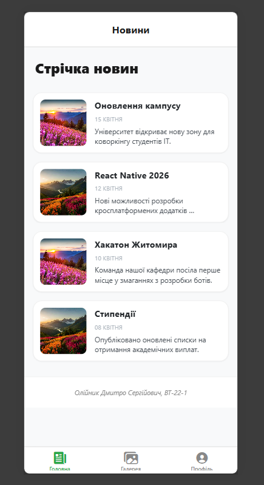
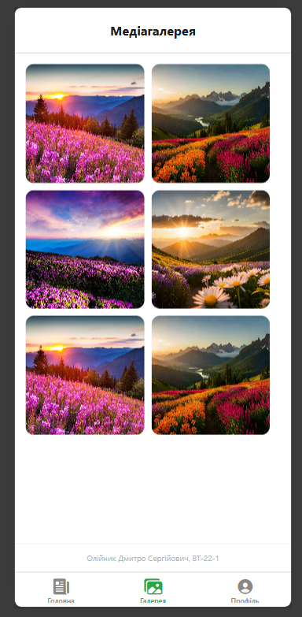
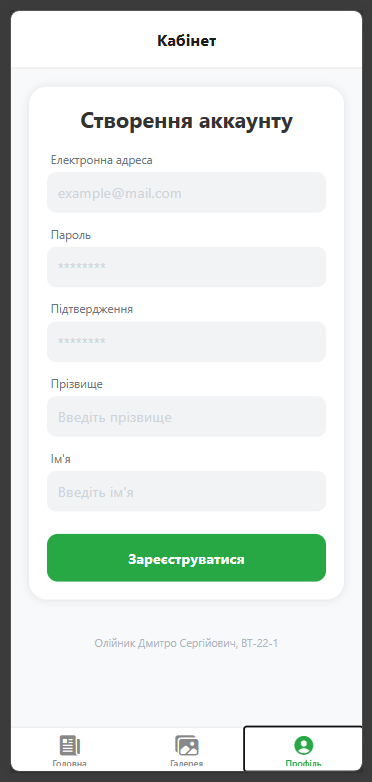

# lab1

## Опис проєкту
Даний програмний продукт реалізовано на базі фреймворку React Native в екосистемі Expo для кросплатформового використання. Функціонал структуровано за допомогою трьох основних модулів: інформаційної стрічки, адаптивної медіа-галереї та сторінки профілю користувача.

## Інструкція із запуску
1. Клонувати репозиторій:
`git clone https://github.com/Dmytriy-OL/MobileLabsRN2026`

2. Перейти в папку лабораторної роботи:
`cd lab1`

3. Встановити залежності:
`npm install`

4. Запустити проєкт:
`npx expo start`

## Основні способи запуску мобільного додатка

### 1. Тестування на реальному пристрої (Expo Go)
Найбільш практичний метод, що дозволяє перевірити взаємодію з інтерфейсом безпосередньо на смартфоні. Для синхронізації достатньо відсканувати QR-код через камеру або фірмовий додаток Expo, що забезпечує миттєвий доступ до поточної збірки проєкту.

### 2.Використання емуляції (Android Studio)
Оптимальне рішення для розробників, які не мають під рукою фізичного девайса. Запуск відбувається у віртуальному середовищі (AVD), що дозволяє симулювати роботу конкретних моделей телефонів та проводити налагодження програмного забезпечення в ізольованому системному просторі.

### 3. Веб-сесія (Web View)
Найшвидший шлях для валідації загальної структури та дизайну. Запуск у браузері дозволяє оперативно вносити правки в UI-компоненти та перевіряти бізнес-логіку додатка без необхідності розгортання повноцінного мобільного оточення.

## Скріншоти екранів застосунку

### Головна

### Фотогалерея

### Профіль
