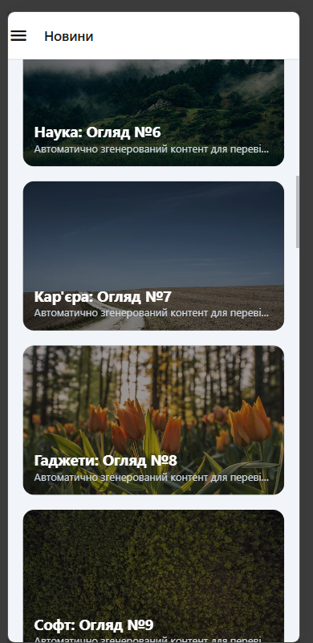
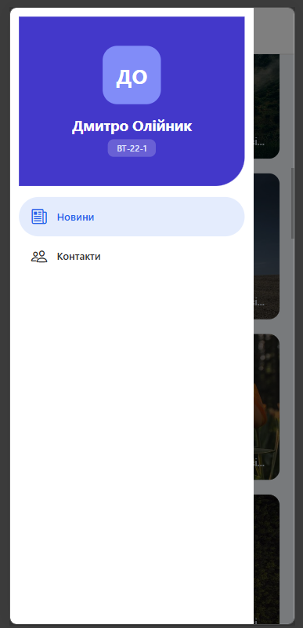
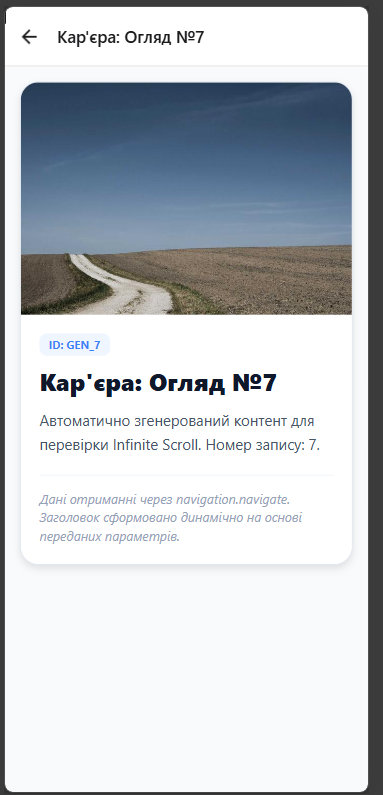
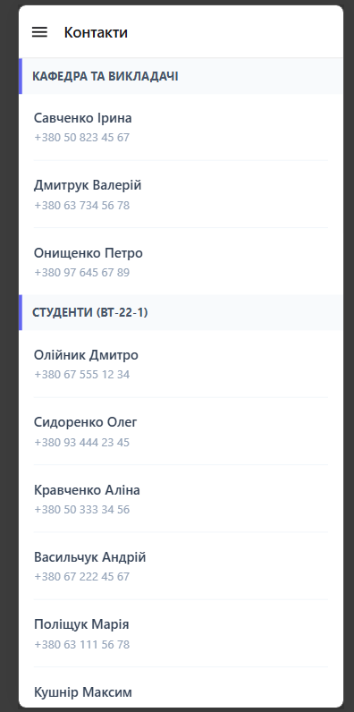

# lab2

## Технічний опис
Ця розробка представляє собою мобільний клієнт, побудований на базі фреймворку React Native (середовище Expo). Ключове завдання полягало у проектуванні архітектури навігації, що поєднує в собі бічне меню (Drawer Navigator) та лінійні переходи між екранами (Stack Navigator).

Функціональні модулі додатка:
- Стрічка новин — базовий екран із переліком актуальних подій.
- Перегляд публікації — деталізована сторінка для читання обраної новини.
- Телефонний довідник — розділ із контактною інформацією та списками.

## Інструкція із запуску
1. Клонувати репозиторій:
`git clone https://github.com/Dmytriy-OL/MobileLabsRN2026` 

2. Перейти в папку лабораторної роботи:
`cd /lab2`

3. Встановити залежності:
`npm install`

4. Запустити проєкт:
`npx expo start -c`

## Специфікація навігаційної логіки
В архітектурі додатка застосовано комбінований підхід до навігації. Основним рівнем виступає Drawer Navigator, що забезпечує глобальний доступ до ключових розділів через бокове меню:
- Інформаційний блок (Новини)
- Довідковий блок (Контакти)

Для глибшої ієрархії всередині розділу новин було інтегровано додатковий Stack Navigator. Він керує переходами між наступними компонентами:
- MainScreen — інтерфейс із загальним переліком публікацій.
- DetailsScreen — екран для детального ознайомлення зі змістом конкретного об'єкта.

### Робота зі стрічкою новин
Для виводу даних використано FlatList. Кожна новина складається з ID, заголовка, опису та зображення.
Функціонал списку:

- Pull-to-Refresh: скидання та оновлення стрічки жестом зверху.
- Infinite Scroll: автоматичне додавання контенту під час скролу.
- Async Mock: імітація затримки мережі через setTimeout.
- UI блоки: використано кастомні Header, Footer та розділювач елементів.

Конфігурація продуктивності:
- Для швидкої роботи інтерфейсу налаштовано параметри рендерингу: initialNumToRender, maxToRenderPerBatch та windowSize. Це дозволяє уникнути фризів при великій кількості новин.

### Сторінка перегляду новини
Для відображення повного змісту реалізовано:
- Навігаційні переходи: відкриття детальної сторінки з головного екрана.
- Params Passing: передача об’єкта новини (id, заголовок, опис, фото) через route.params.
- Dynamic Title: автоматичне формування назви у хедері залежно від обраного контенту.
- Header Sync: приховано дублювання панелі навігації завдяки параметру headerShown: false у Drawer для Stack-модуля.

### Сторінка з контактами
Дані структуровані та виведені за допомогою компонента SectionList.

Використані технічні рішення:
- Групування: розділення контактів за категоріями через пропс sections.
- Рендеринг: кастомна стилізація окремих рядків (renderItem) та заголовків груп (renderSectionHeader).
- Оптимізація: унікальна ідентифікація через keyExtractor.
- Візуал: додано роздільну лінію між контактами за допомогою ItemSeparatorComponent.

### Персоналізоване меню (Drawer)
Розроблено власну структуру drawerContent для бокового меню, що включає:
- Блок профілю: відображення аватара користувача з ініціалами.
- Ідентифікація: вивід імені (Олійник Дмитро) та коду академічної групи.
- Навігаційні посилання: стилізований список переходів до розділів «Новини» та «Контакти».

## Результати тестування інтерфейсу

### Головна стрічка подій

### Панель бічної навігації

### Перегляд детальної інформації

### Телефонний довідник

## Підсумки роботи

### 1. Порівняння FlatList та ScrollView
ScrollView завантажує весь контент одночасно, тому він ефективний лише для статичних або невеликих сторінок. FlatList працює динамічно, відображаючи тільки те, що бачить користувач, що критично для збереження ресурсів пам'яті.

### 2. Суть віртуалізації
Це технологія оптимізації, яка видаляє з пам'яті невидимі елементи списку та рендерить їх лише за потреби. Це дозволяє додатку працювати стабільно навіть із сотнями записів.

### 3. Механізм обміну даними
Транспортування даних відбувається через метод navigation.navigate. Відправлений об'єкт стає доступним на цільовому екрані через хук або властивість route.params.

### 4. Реалізація вкладеної навігації
Це ієрархічна структура, де один тип навігатора (наприклад, Stack) інтегрується всередину іншого (Drawer). Це дозволяє комбінувати різні логіки переходів у межах одного застосунку.

### 5. Призначення SectionList
Цей компонент використовується для виводу структурованих масивів, які потребують логічного розділення на іменовані групи або тематичні блоки.