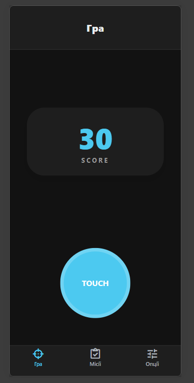
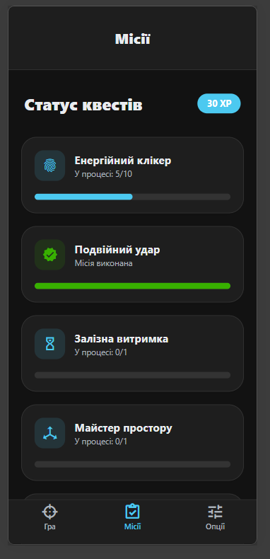
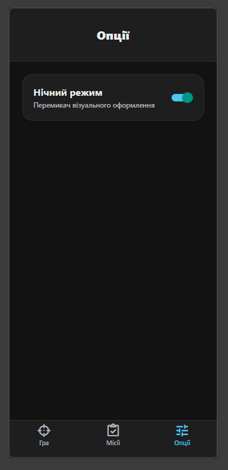

# Lab3

## Опис проєкту
Інтерактивний додаток на React Native + Expo Router, фокусований на складній обробці жестів (Reanimated + Gesture Handler) та динамічній зміні тем без перевантаження компонентів.

**Структура та Технології**
- Navigation: Expo Router (File-based routing).
- State: React Context API (AppStatusContext) для керування XP та темами.
- Gestures: react-native-gesture-handler (Simultaneous & Exclusive gestures).
- UI Components: Власна бібліотека адаптивних компонентів (AppText, AppView, AppIcon).

**Екрани:**
* **Ігровий портал:** (app/(tabs)/index.tsx)
  - Single Tap: +1 XP.
  - Double Tap: +5 XP.
  - Long Press (2.5s): +25 XP.
* **Статус квестів:** (app/(tabs)/stats.tsx)
  - Візуалізація прогресу за допомогою AchievementCard та прогрес-барів.
* **Опції:**(app/(tabs)/config.tsx)
  - Перемикання тем та налаштування інтерфейсу.
* **Інфо-модал:** (app/modal.tsx) 
  -  Опис механік проекту.

**Технічні особливості:**
* **Theme Engine:** Автоматична адаптація кольорів через хуки useAppTheme та useBrandColor.
* **Sticky Header:** Паралакс-ефект у заголовках через StickyHeaderContainer.
* **Cross-platform:**Підтримка специфічних іконок для iOS/Android та безпечна гідратація для Web.

## Інструкція із запуску
1. Клонувати репозиторій:
`git clone https://github.com/Dmytriy-OL/MobileLabsRN2026`

1. Перейти в папку лабораторної роботи:
`cd lab3/my-app`

1. Встановити залежності:
`npm install`

1. Запустити проєкт:
`npx expo start`

## Методи розгортання та тестування

### 1. Фізичні пристрої (Expo Go)
Для повноцінної перевірки мультитач-взаємодій (особливо Pinch та Pan) рекомендовано використовувати Expo Go.
- Як запустити: Виконайте команду npx expo start та проскануйте QR-код.
- Перевага: Тільки на реальному залізі можна відчути відгук анімації withSpring та коректну роботу Simultaneous Recognition.

### 2. Віртуальні середовища (Simulators)
Емулятори Android та симулятори iOS використовуються переважно для візуального дебагу UI-компонентів (AppView, AppText).
- Клавіші швидкого доступу: a — запуск Android, i — запуск iOS.

### 3. Реалізовані механіки та Gesture API
Проєкт використовує декларативний підхід до обробки жестів. Основна логіка зосереджена в app/(tabs)/index.tsx:
* **Ексклюзивні тапи (Gesture.Exclusive):**
    - Одиночний тап: Інкремент основного лічильника (+1 XP).
    - Double Tap: Бонус за швидкість (+5 XP). Система ігнорує одиночний клік, якщо розпізнано подвійний.
* **Тривале утримання (Long Press):**Активація через 2.5 секунди. Нараховує +25 XP та завершує квест "Залізна витримка".
 * **Складена маніпуляція (Simultaneous):**
    - Pan (Перетягування): Об'єкт вільно рухається за пальцем. Після відпускання спрацьовує withSpring для повернення в початкові координати.
    - Pinch (Зум): Зміна масштабу (scale) вузла в реальному часі.
* **Анімаційний двигун:** Усі трансформації обробляються через useAnimatedStyle (Reanimated), що забезпечує 60 FPS навіть при складних рухах.

## Скріншоти екранів застосунку

### Гра (Клікер)

### Список місій

### Опції
