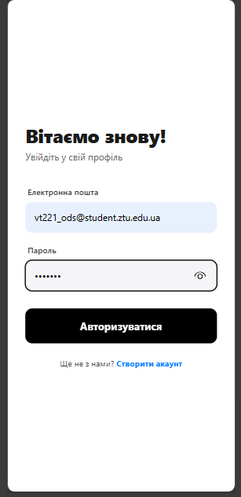
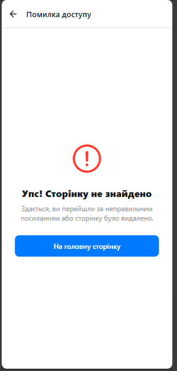
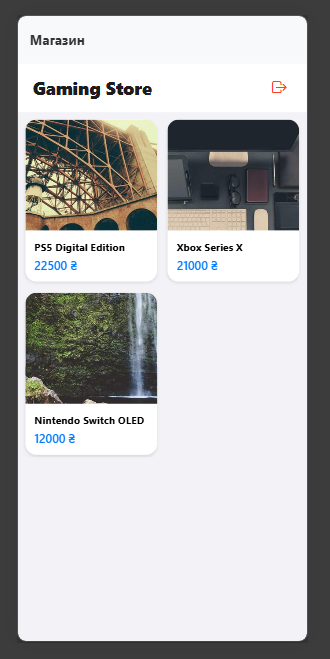
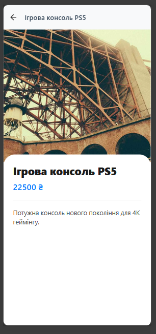

# Lab 5

## Опис проєкту
Проєкт представляє собою мобільний додаток-каталог ігрових консолей та аксесуарів. Основна мета — реалізація дворівневої навігації з розмежуванням прав доступу. Архітектура побудована на базі Expo Router із використанням файлової системи маршрутизації.

---

## Інструкція із запуску
1. Клонувати репозиторій:
`git clone https://github.com/Dmytriy-OL/MobileLabsRN2026`

2. Перейти в папку лабораторної роботи:
`cd lab5/my-app`

3. Встановити залежності:
`npm install`

4. Запустити проєкт:
`npx expo start -c`

----

## Функціонал
* Глобальний стан (Context API): Створено SessionProvider для керування сесією користувача (авторизація, збереження профілю).
* Захищені маршрути (Protected Routes): Доступ до каталогу товарів у папці (app) заблоковано для неавторизованих користувачів через механізм <Redirect />.
* Динамічна навігація: Реалізовано переходи на детальні сторінки товарів за допомогою динамічних шляхів [id].jsx.
* Уніфікація стилів: Впроваджено систему тем через UIConfig та кастомний хук useAppTheme.

---

## Контрольні запитання

**1. Яким чином реалізується перенаправлення неавторизованого користувача?**  
Реалізовано в app/(app)/_layout.jsx через перевірку стану isAuthenticated, який постачає useAuth. Якщо користувач не в системі, Layout повертає компонент <Redirect href="/(auth)/login" />, що блокує доступ до внутрішніх сторінок і примусово відправляє на екран входу. 

**2. У чому полягає різниця між використанням компонента <Link> та метода router.push()?**  
Декларативний спосіб навігації. Використовується безпосередньо в JSX-розмітці для переходів між екранами (наприклад, перехід на реєстрацію).
- router.push() / replace(): Програмний (імперативний) спосіб. Використовується всередині бізнес-логіки, наприклад, у моєму SessionManager для автоматичного переходу до магазину після успішного виконання signIn.

**3. Як працюють динамічні маршрути і як отримати параметри?**  
Динамічні маршрути створюються шляхом використання квадратних дужок у назві файлу (у моєму випадку app/(app)/details/[id].jsx). Для отримання значення id використовується хук useLocalSearchParams, що дозволяє відображати інформацію про конкретний товар залежно від вибору користувача.

**4. Чому стан авторизації доцільно зберігати у React Context?**  
Це забезпечує "єдине джерело істини" для всього додатка. Використання UserSession контексту дозволяє будь-якому компоненту (наприклад, захищеному лейауту або кнопці виходу) отримати доступ до даних користувача та функцій signIn/signOut без необхідності передавати їх через ланцюжок пропсів.

**5.Для чого використовуються групи маршрутів (folderName) і як вони впливають на URL-адресу?**  
Групи (папки в круглих дужках) дозволяють організувати структуру проєкту за змістом (авторизація окремо, основний контент окремо). На структуру URL вони ніяк не впливають, що дозволяє мати чисті шляхи (наприклад, просто /login замість /(auth)/login), зберігаючи при цьому окремі налаштування Stack для кожної групи.

---

### 1. Екран авторизації (Public Route)

**Опис:**
* **Інтерфейс користувача:** Реалізовано сучасну форму входу з використанням KeyboardAvoidingView для коректного відображення на мобільних пристроях. Поля вводу мають кастомну стилізацію з округленими кутами та логічним зонуванням.
* **Функціонал signIn** При натисканні на кнопку «Авторизуватися» спрацьовує метод із SessionManager, який імітує мережевий запит (використовуючи стан isSyncing) та змінює глобальний стан isAuthenticated.
* **Динамічний UX:** Кнопка входу підтримує стан завантаження — під час обробки даних з'являється ActivityIndicator, а поля вводу блокуються для запобігання повторних запитів.
*  **Навігація:** Екран містить декларативне посилання <Link> для швидкого переходу до створення нового облікового запису.

### 2. Екран обробки помилок (Not Found / 404)

**Опис:**
* **Спеціальний маршрут:** Реалізовано через системний файл +not-found.jsx, який автоматично перехоплює будь-які некоректні URL-адреси або запити до неіснуючих сторінок додатка.
* **Користувацький досвід (UX):** Замість стандартної помилки системи, користувач бачить інформативне повідомлення про відсутність сторінки, що відповідає загальній стилістиці інтерфейсу.
* **Механізм повернення:** Кнопка «На головну сторінку» використовує метод router.replace(), що дозволяє скинути стек навігації та безпечно повернути користувача до початкового екрана (авторизації або каталогу, залежно від стану сесії).
* **Призначення:** Демонструє стійкість архітектури додатка до помилкових дій користувача та цілісність системи маршрутизації Expo Router.

### 3. Головний екран: Каталог товарів (Protected Route)

**Опис:**
* **Захищений доступ:** Екран знаходиться всередині групи маршрутів (app). Доступ до нього автоматично блокується провайдером сесії, якщо користувач не пройшов авторизацію.
* **Інтерфейс та верстка:** Реалізовано адаптивну сітку товарів за допомогою компонента FlatList із параметром numColumns={2}. Кожна картка товару містить зображення, назву та ціну, відформатовану за допомогою утиліти formatCurrency.
* **Навігація та інтерактивність:** 
  - Кожна картка загорнута в компонент <Link>, який забезпечує перехід до динамічного маршруту детальної сторінки товару.
  - У верхній частині інтерфейсу (Header) розміщено кнопку виходу, яка викликає функцію signOut із SessionManager, миттєво анулюючи сесію та перенаправляючи користувача на екран входу.
* **Стилізація:** Використано кастомну палітру кольорів із UIConfig, що забезпечує сучасний вигляд карток із легким затіненням та заокругленнями.

### 4. Сторінка деталей товару (Dynamic Route)

**Опис:**
* **Динамічна маршрутизація:** Екран реалізовано у файлі app/(app)/details/[id].jsx. Система автоматично зчитує параметр id з URL за допомогою хука useLocalSearchParams(), що дозволяє відображати контент конкретного товару, вибраного в каталозі.
* **Візуальні ефекти (Parallax):** Використано кастомний компонент ParallaxWrapper на базі бібліотеки react-native-reanimated. При скролінгу зображення товару плавно масштабується та зміщується, створюючи ефект глибини, а блок із описом «наповзає» на шапку.
* **Стилізація контенту:** Опис товару та ціна виведені у контейнері з білим фоном та закругленими верхніми кутами (borderTopRadius). Це створює сучасний UX, де основна інформація завжди залишається читабельною поверх медіа-контенту.
* **Навігація:** У заголовку (Header) інтегрована кнопка «Назад», яка дозволяє користувачеві миттєво повернутися до списку товарів, зберігаючи при цьому стан прокрутки головного екрана.
---
* **Висновок:** Під час роботи реалізовано дворівневу навігацію за допомогою Expo Router. Впроваджено систему Protected Routes через React Context для розмежування доступу між публічними та захищеними розділами. Опановано роботу з динамічними маршрутами та кастомними анімаціями, що дозволило створити стабільний додаток із сучасним UX.